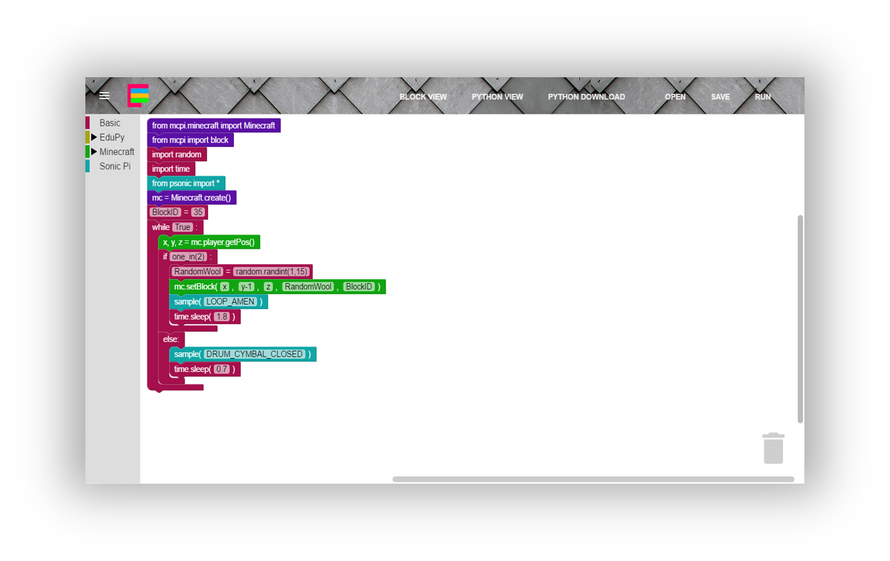
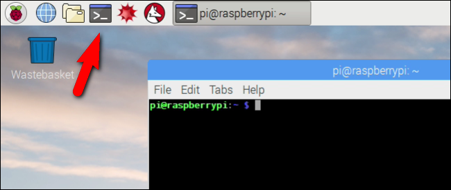
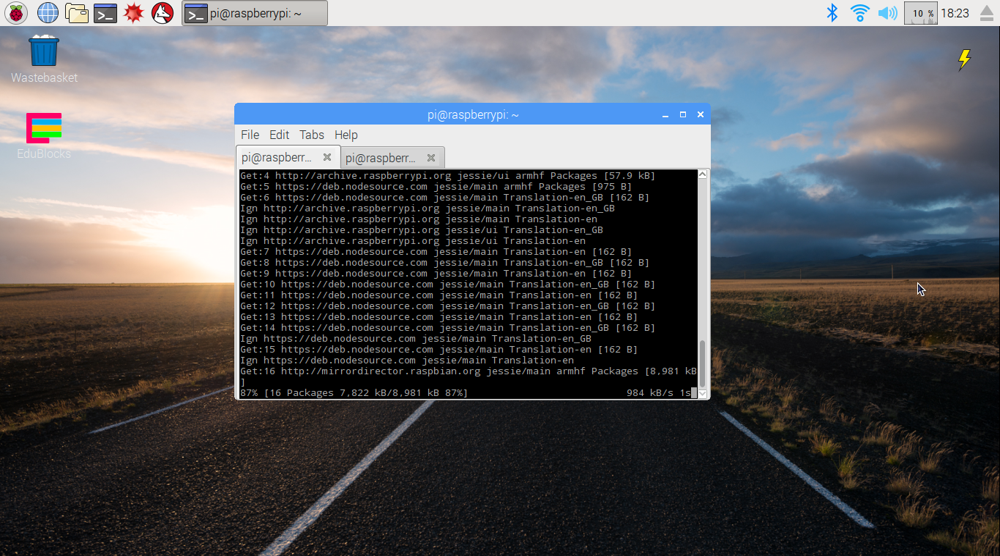
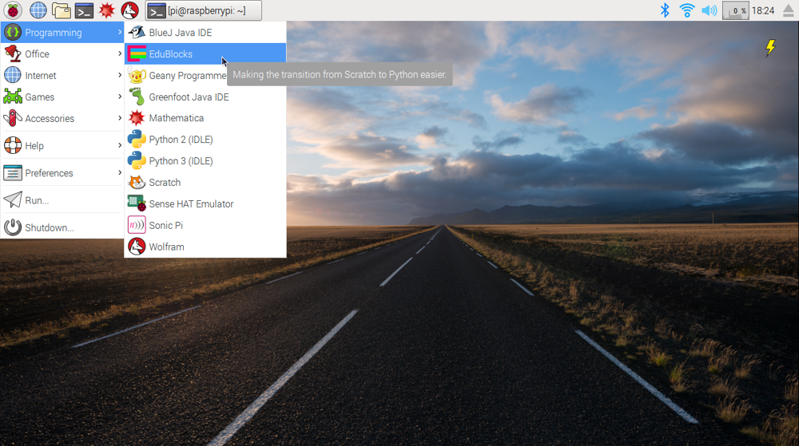
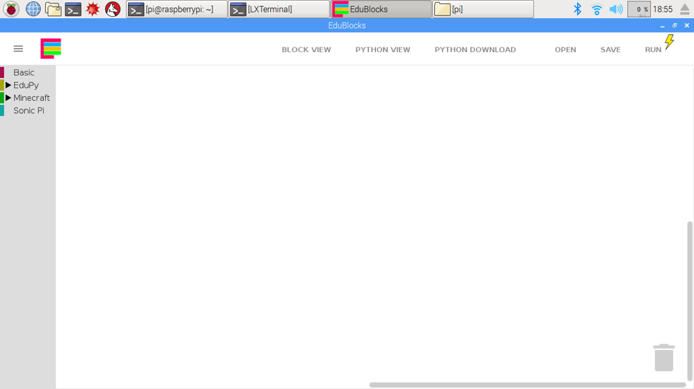

Welcome to the EduBlocks Github Repository!
===========================================

About EduBlocks
---------------
EduBlocks is a visual block based programming tool that will hopefully help teachers to introduce text based programming languages, like Python, to children at an earlier age.

EduBlocks features:
* Block Format:
Easy and simple interface that uses a building block format to code.
* Extensive Documentation:
Lots of documentation to get you ready to go quickly. New projects added every 2 weeks.
* Range of libraries:
EduBlocks has a range of libraies like EduPython, Minecraft & Sonic Pi. (COMING SOON: GpioZERO, Sense Hat)
* Python View:
Once you have coded the blocks, you can easily switch to the Python View to see the real Python code.

Status
---------------
### Build Status


### Branch Status


Installation
------------
Get started with EduBlocks on your Raspberry Pi in these simple steps:

1. Open up a terminal window by clicking on the terminal icon on the top right hand corner of your Raspberry Pi's Screen

2. Type the following command and then press enter on your keyboard.
```bash
curl -sSL edu.buz.co | bash
```

3. When promted by the installer, press enter to select YES to install.

4. The installer will now run for a few minutes. This depends on your internet speeds.

5. You will now be able to see EduBlocks in the Raspberry Pi >> Programming menu. Click on the EduBlocks link to run the program.

6. After around half a minute, you should be able to see the EduBlocks workspace. Happy Coding.


Did this not work for you? Look at the Support section of this document.

Developer Instructions
----------------------

### Dependencies

Install Node.JS 6+ using the appropriate installer for your platform

Install Yarn:

    npm --global install yarn

### Building EduBlocks

The PIP package can be built using a shell script. This will create the subdirectory `build`.

To run build script:

    ./build.sh

### Running Server and Client in developer mode

To run the server and client in desktop in developer mode:

    cd server
    yarn install
    yarn run debug

In another terminal:

    cd ui
    yarn install
    yarn start
    
Manual Install
--------------

If you would rather mannually install EduBlocks instead of running our command. Here is the commands to do it:
```
wget http://edublocks.org/downloads/edublocks-armv6l.tar.xz

tar -xf edublocks-armv6l.tar.xz

edublocks/install-deps.sh

edublocks/install.sh
```

Support
-------

Need help or support with EduBlocks? There are a few ways in which you can get in touch with us. We try our best to provide a speedy and smooth support service for our users. It may take us a few hours to respond as EduBlocks is not our full time jobs/ commitment. Also, it may take a few days/weeks/months before your request is solved.

### Twitter

EduBlocks Support: @edu_blocks
<br>
All About Code: @all_about_code

### Email

Support Email: support@edublocks.org
<br>
Joshua Email: josh@edublocks.org
<br>
Chris (Developer) Email: chris@edublocks.org

### Website

EduBlocks: http://edublocks.org
<br>
All About Code: http://allaboutcode.co.uk

Ways to contribute
-----------

We want to make EduBlocks a community project. We are open to people opening issues, giving us feedback on how we can improve and opening pull requests to add features or fixes to the project. The community plays a huge part in EduBlocks.

Contributors
-----------

Meet the contributers who make EduBlocks a reality.

### Joshua Lowe @joshualowe1002

Joshua is the project lead and oversees all new changes. He programs he blocks and adds new libraries and features. Josh also was the founder of EduBlocks.

### Chris Dell @cjdell

Chris is a freelance software developer who works on the programming and software side of EduBlocks. He works with Joshua to make his ideas a reality.

### Les Pounder

Les is a freelance software developer who mainly contributed on the original install script making sure that anyone can install EduBlocks with ease. Also Les helps with writing and making sure EduBlocks is out there in the Raspberry Pi community. Les is also a pi-top champion meaning we can borrow 10 pi-tops for our workshops.

### Chris Penn (AKA NCS:Computing) @ncscomputing

Chris P developed the first ever EduBlocks resource sheets within the HackPack anthology. Also, Chris P suggested that MineCraft should be incuded with EduBlocks. Chris also blogs about his cool uses of new EduBlocks features.

We would also like to recognize the following companies. These may not have contibuted to software but have contributed in other ways.

### Makerspace @ CPC:
For supplying GPIO equimpment for workshops and helping EduBlocks out whenever we need them. They are a truly great team. Thanks Kev, Rachel & Ivan!

### Pimoroni:
For letting us visit the ship at Sheffield-On-Sea to promote and learn about software & hardware to improve EduBlocks and for being awesome people. Thanks Jon, Paul, Phil, Sandy & The team.

### Pi-Top:
For the pi-top champions program and giving us access to 10 pi-tops for our workshops through Les Pounder.


