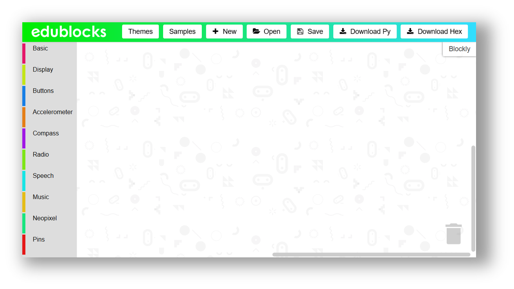

Welcome to the EduBlocks for micro:bit Github Repository!
===========================================

About EduBlocks
---------------
EduBlocks is a visual block based programming tool that will hopefully help teachers to introduce text based programming languages, like Python, to children at an earlier age.

# The micro:bit editor can be found at 

EduBlocks features:
* Block Format:
Easy and simple interface that uses a building block format to code.
* Extensive Documentation:  
Lots of documentation to get you ready to go quickly. New projects added every 2 weeks.
* Range of features:
Includes majority of the micropython system.
* Python View:
Once you have coded the blocks, you can easily switch to the Python View to see the real Python code.
* Multi-Device:
Runs on most computers with a USB port running a web brower.

Status
---------------
### Build Status
]

### Branch Status

Developer Instructions
----------------------

NOTE: Windows users will need to enable symbolic link support before they attempt to clone the repository!

### Dependencies

Install Node.JS 6.10.3 using the appropriate installer for your platform. For Linux and Mac OS X (and also Bash on Windows), we recommend using NVM for this.

Install Yarn:

    npm --global install yarn

### Running Server and Client locally in developer mode on your PC

Developer mode allows you to run EduBlocks on your PC and watch for live code changes for developer convenience.

Open two terminal windows/tabs.

In the first terminal, run the UI watcher:

    cd ui
    yarn
    yarn run watch

In the second terminal, run the server:

    cd server
    yarn
    yarn run watch

EduBlocks micro:bit UI will now be available at http://localhost:8081/

#### Bash on Windows instructions (better instructions will follow)

    sudo apt install git build-essential
    curl -o- https://raw.githubusercontent.com/creationix/nvm/v0.33.2/install.sh | bash
    . ~/.nvm/nvm.sh
    nvm install 6.10.3
    npm --global install yarn

    git clone git@github.com:AllAboutCode/EduBlocks/

    cd EduBlocks
    git checkout microbit
    cd ui
    ln -s ../../server/src/protocol.ts src/protocol.ts

    yarn
    yarn run build

    cd ../server
    yarn
    yarn run watch

### Releasing a new version

Increment version, this will automatically tag the current commit as the new version. E.G. 0.0.19-microbit:

    yarn version

Push changes along with the new tag to GitHub, triggering a new build:

    git push --tags
    git push

Once build has completed successfully, a new build will be available at:

    http://edublocks.org/downloads/edublocks-armv6l.tar.xz

### Building EduBlocks

Building is performed by our CI platform. See `circle.yml` for more info. The tarball is built using a shell script. This will create the subdirectory `edublocks`. The build script is only intended to be run by the CI platform however it will probably work on most Linux platforms.

To run build script:

    ./tarball-create.sh

Support
-------

Need help or support with EduBlocks? There are a few ways in which you can get in touch with us. We try our best to provide a speedy and smooth support service for our users. It may take us a few hours to respond as EduBlocks is not our full time jobs/ commitment. Also, it may take a few days/weeks/months before your request is solved.

### Twitter

EduBlocks Support: @edu_blocks
 
All About Code: @all_about_code

### Email

Support Email: support@edublocks.org
 
Joshua Email: josh@edublocks.org
 
Chris (Developer) Email: chris@edublocks.org

### Website

EduBlocks: http://edublocks.org
 
All About Code: http://allaboutcode.co.uk

Ways to contribute
-----------

We want to make EduBlocks a community project. We are open to people opening issues, giving us feedback on how we can improve and opening pull requests to add features or fixes to the project. The community plays a huge part in EduBlocks.

Contributors
-----------

Meet the contributers who make EduBlocks a reality.

### Joshua Lowe @joshualowe1002

Joshua is the project lead and oversees all new changes. He programs he blocks and adds new libraries and features. Josh also was the founder of EduBlocks.

### Chris Dell @cjdell

Chris is a freelance software developer who works on the programming and software side of EduBlocks. He works with Joshua to make his ideas a reality.

### Les Pounder

Les is a freelance software developer who mainly contributed on the original install script making sure that anyone can install EduBlocks with ease. Also Les helps with writing and making sure EduBlocks is out there in the Raspberry Pi community. Les is also a pi-top champion meaning we can borrow 10 pi-tops for our workshops.

### Chris Penn (AKA NCS:Computing) @ncscomputing

Chris P developed the first ever EduBlocks resource sheets within the HackPack anthology. Also, Chris P suggested that MineCraft should be incuded with EduBlocks. Chris also blogs about his cool uses of new EduBlocks features.

We would also like to recognize the following companies. These may not have contibuted to software but have contributed in other ways.

### Makerspace @ CPC:
For supplying GPIO equimpment for workshops and helping EduBlocks out whenever we need them. They are a truly great team. Thanks Kev, Rachel & Ivan!

### Pimoroni:
For letting us visit the ship at Sheffield-On-Sea to promote and learn about software & hardware to improve EduBlocks and for being awesome people. Thanks Jon, Paul, Phil, Sandy & The team.

### Pi-Top:
For the pi-top  FUTUREchampions for giving us acess to 4 pi-top CEEDS for demonstrating and running EduBlocks workshops.
